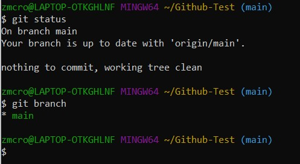
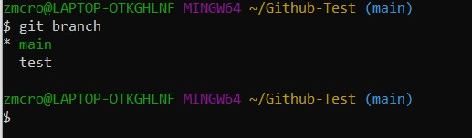

# Branch

## Definition

* A fork is a copy of a repository, and forking a repository allows a user to make changes without affecting the original project [1]
* Represents an independent line of development, where users can then continue the edit/stage/commit process [2]

## Examples

Sources:
* [Git Branch](https://www.git-tower.com/learn/git/commands/git-branch)
* [Using Branches](https://www.atlassian.com/git/tutorials/using-branches)

[Link to Previous Page](/terms.md) 

