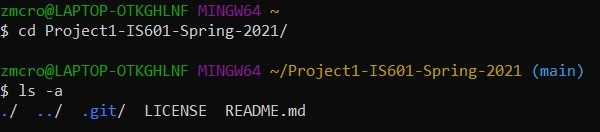
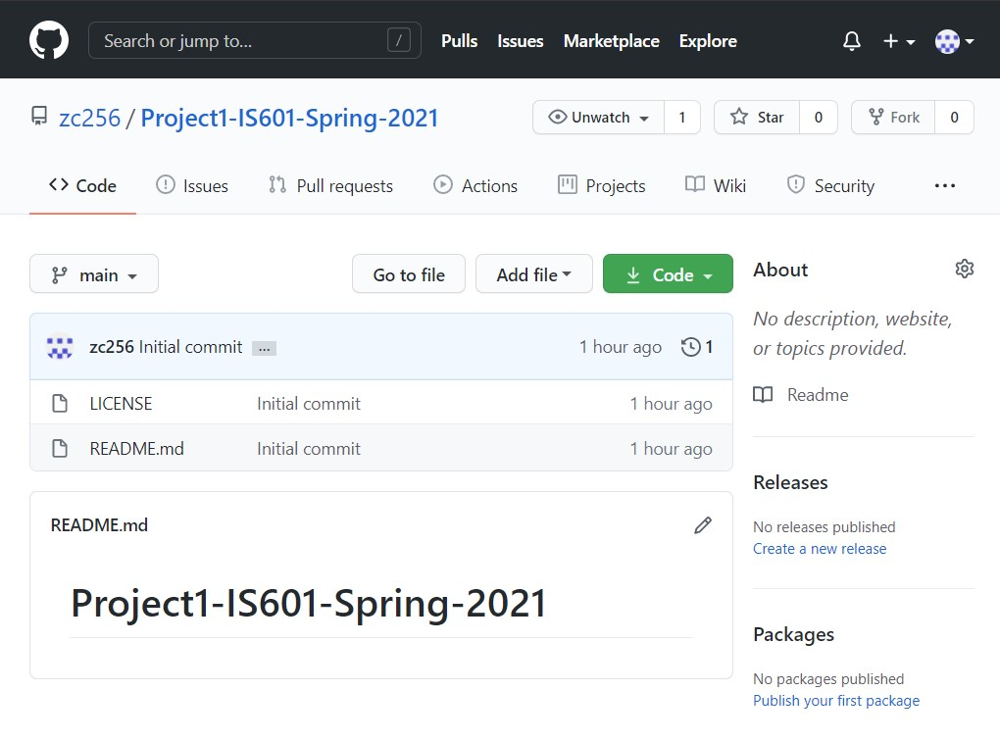
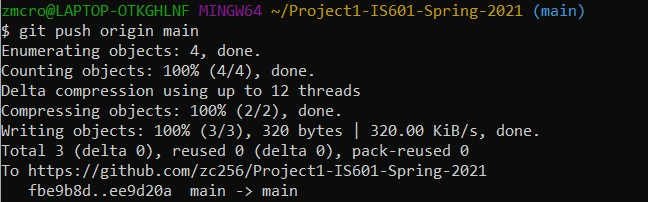

# Clone

## Definition

* Allows users to obtain a local development clone of an already existing central repository [1]
* How to clone a repository:
	* “git clone”
	* Used to create a copy or clone of remote repositories [1]
	* Must pass a repository URL, and supports a few different URL formats (HTTPS, SSH, GitHub CLI) [1]
	* Creates a remote connection called “origin” which points back to the original repository [2]

## Examples 
Here **git clone** is being used to clone the repository "Project1-IS601-Spring-2021" using HTTPS

Changing the directory to the cloned repository "Project1-IS601-Spring-2021", and checking to see if the files were cloned successfully

Seeing that "Project1-IS601-Spring-2021" on GitHub matches the files that were cloned

Creating a basic markdown file, git.md, and checking its status using **git status**

Adding the file, git.md, to the staging area, and then commiting the changes.

Pushing the changes from origin to main

Checking to see that the file was pushed successfully. In this case, it was a success

Sources:

* [Setting up a repository](https://www.atlassian.com/git/tutorials/setting-up-a-repository) 
* [git clone](https://www.atlassian.com/git/tutorials/setting-up-a-repository/git-clone)

[Link to Previous Page](/terms.md)