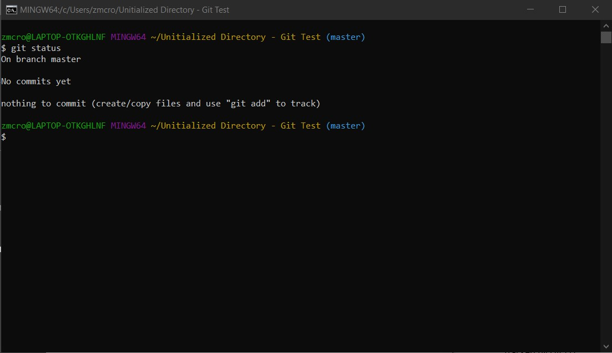

# Status

## Definition
* Displays state of the working directory and staging area [1]
* Shows what changes have or have not been staged, and the files that are currently being tracked by Git [1]
* Does not show any information in regards to the commits history [1]

## Examples

Sources:
* [Inspecting a Repository](https://www.atlassian.com/git/tutorials/inspecting-a-repository)

[Link to Previous Page](/terms.md)