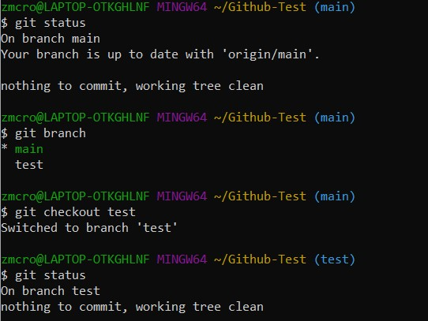

# Checkout

## Definition
* Lets the user navigate between the branches that are created with git branch [1]
* Checking out a branch updates the files in the working directory to match the version stored in that branch, and tells Git to record all new commits on that branch [1]

## Examples

Sources:
* [Git Checkout](https://www.atlassian.com/git/tutorials/using-branches/git-checkout)

[Link to Previous Page](/terms.md)