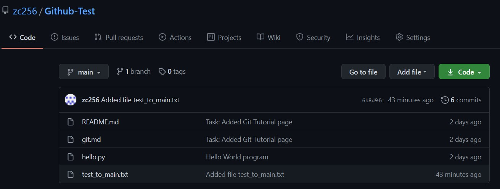
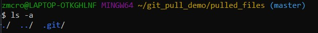
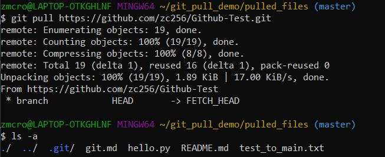

# Pull 

## Definition
* Used to fetch and download content from a remote repository and thus updates the local repository to match that content [1]
## Examples

Sources:
* [Git Pull](https://www.atlassian.com/git/tutorials/syncing/git-pull)

[Link to Previous Page](/terms.md)