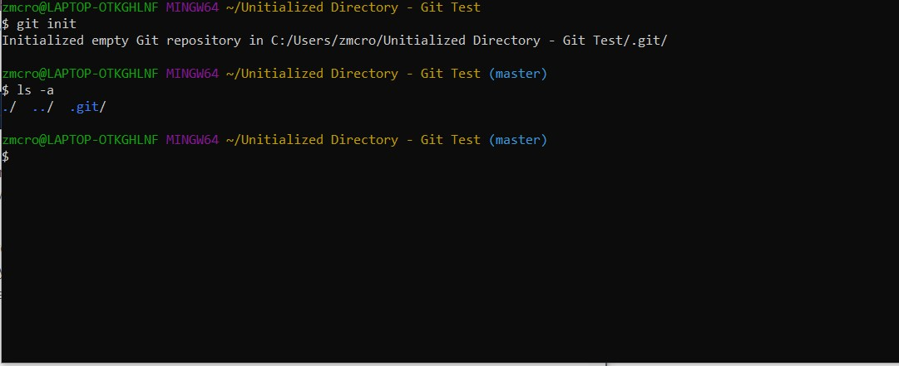

# Repository

## Definition

* Virtual storage of your project [1]
* Allows you to save versions of your project, which you can then access at any time [1]
* How to initialize a repository:
    * "git init"
    * Creates a new Git repository
    * Can convert an existing project to a Git repository or initialize a new, empty repository
    * Creates a .git subdirectory in the current working directory

## Examples

Before initializing a new, empty repository in the directory "Unitialized Directory - Git Test". There is not ".git" file, so it has not become a Git repository yet.

Initializing a new, empty repository in the directory "Unitialized Directory - Git Test". The ".git" file indicates that **git init** did its job.

Sources:
[1] [Setting up a repository](https://www.atlassian.com/git/tutorials/setting-up-a-repository)

[Link Back to Previous Page](/terms.md)